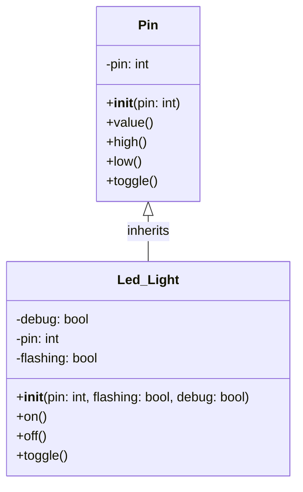
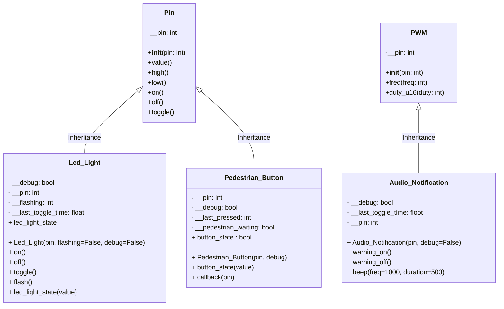

# Lecture 1

## Lecture 1 Concepts

- [Unit Testing](#unit-testing)
  - [Wokwi Unit Testing](#wokwi-unit-testing)
  - [Physical Unit Testing](#physical-unit-testing)
- [UML Class Diagrams](#uml-class-diagrams)
  - [Mermaid Markdown UML Class Diagram Example](#mermaid-markdown-uml-class-diagram-example)
- [Generalisation](#generalisation)
- [Super/Sub Classes](#supersub-classes)
  - [Pin Library](#pin-library)
  - [PWM Library](#pwm-library)
- [Instantiation](#instantiation)


## Unit Testing

Unit testing is the process of writing and running small, isolated tests that check the correctness of individual pieces of code (such as functions or modules). The goal is to ensure that each unit of your embedded software works as expected, independently from the rest of the system.

Unit testing is especially valuable in embedded systems, such as the Pi Pico, where debugging can be challenging due to limited resources and hardware complexity. By ensuring each component works independently, you can build more complex mechatronic solutions.

### Wokwi Unit Testing

Students should copy the provided script [v02.py](..\project\py_scripts\v02.py) into the main.py tab in the [Wokwi](https://wokwi.com/) IDE. Then click the `Play` button in the simulator window.

1. All 5 LEDs should illuminate.
2. The buzzer should emit an animated musical note on screen, and if the volume is turned up, a constant tone.
3. The momentary switch should return `1` to the IDE terminal when closed (pressed) and 0 when not closed (depressed).

### Physical Unit Testing

Unit test using the provided script [\project\py_scripts\v02.py](..\project\py_scripts\v02.py). In VSCode: <kbd>Ctrl</kbd> + <kbd>Shift</kbd> + <kbd>P</kbd> or <kbd>Command</kbd> + <kbd>Shift</kbd> + <kbd>P</kbd> -> Select **MicroPico: Connect**. Then right-click `v02.py` -> choose **_run current file on pico_**.  

1. All 5 LEDs should illuminate.
2. The buzzer should emit a constant tone.
3. The momentary switch should return `1` to the IDE terminal when closed (pressed) and 0 when not closed (depressed).

## UML Class Diagrams

A UML (Unified Modelling Language) class diagram visually describes the structure of a system by showing its classes, their attributes (variables), methods (functions), and relationships (like inheritance).

```text
----------------------
|     Student        |   <-- Class Name
----------------------
| -name: String      |   <-- Attributes
| -age: int          |
----------------------
| +getName(): String |   <-- Methods
| +setAge(int): void |
----------------------
```

### Mermaid Markdown UML Class Diagram Example
Below is a Mermaid class diagram for a Pi Pico GPIO Pin and a custom Led_Light class that inherits from it.



Explanation:

1. Class Name (Top Section): This is the uppermost part of the box. It displays the name of the class (e.g., Student, Order, Car).
2. Attributes (Middle Section): This section lists the attributes (or properties/fields) of the class. Each attribute is typically shown with its visibility (+ for public, - for private, # for protected), name, and type.
3. Methods (Bottom Section): This section lists the methods (or operations/functions) that belong to the class.
Each method is shown with its visibility, name, parameters, and return type.
4. Connections (lines and arrows): These lines and arrows represent relationships (such as inheritance, association, aggregation, and composition) between class boxes.

## Generalisation

On the Pi Pico, the Pin and PWM libraries are designed to be generalised, providing flexible and reusable interfaces for interacting with the microcontroller’s hardware. The simple `on()`, `off()`, `high()` and `low()` methods are not specific to any hardware but are generalised to the nature of a digital GPIO Pin. As a generalised class is inherited and the classes are extended, they become more specific (less generalised) and functional to specific hardware for which they are designed.

## Super/Sub Classes

A Super/Sub (or Parent/Child) Class relationship is a key concept in object-oriented programming (OOP), also known as inheritance. The Super Class defines common attributes and methods.
It acts as a template for other classes.



### Pin Library

[Machine.Pin Library Documentation](https://docs.micropython.org/en/latest/library/machine.Pin.html)

The Pin library in MicroPython for the Pi Pico allows you to control the General Purpose Input/Output (GPIO) pins of the Pico. It allows you to configure pins as digital (binary) inputs or outputs.

### PWM Library

[Machine.Pin Library Documentation](https://docs.micropython.org/en/latest/library/machine.PWM.html)

The PWM Library provides an interface for controlling PWM signals on a specified GPIO pin. It allows you to configure any GPIO pin as a PWM and set the duty cycle and frequency.

## Instantiation

A class is like a blueprint for an object—it defines the attributes and methods the object will have, but it isn’t an actual object itself. Instantiation is the process of creating a copy of the class structure that will be a real, usable object in memory.

```python
from machine import Pin
from time import sleep

led_car_red = Pin(3, Pin.OUT)
led_car_orange = Pin(5, Pin.OUT)
led_car_green = Pin(6, Pin.OUT)

while(True):
    led_car_red.toggle()
    led_car_orange.toggle()
    led_car_green.toggle()
    sleep(1)
```

## Inheritance

Inheritance is a fundamental concept in object-oriented programming (OOP). It allows another class (called a Sub Class) to inherit properties and behaviours (methods and attributes) from another Class (called a Super Class).

In this case, the `Led_Light` Class inherits from the Pin Class, and without any further instructions, the Sub Class inherits and can call all the methods of the Super Class, including `on()`, `off()`, `high()`, `low()`, `toggle()`, etc.


```python
from machine import Pin
from time import sleep

class Led_Light(Pin):
    # Sub Class inherits the 'Pin' Class 
    def __init__(self, pin):
        super().__init__(pin, Pin.OUT)

red_light = Led_Light(3)

while True:
    red_light.on()
    sleep(0.5)
    red_light.off()
    sleep(0.5)
    red_light.high()
    sleep(2)
    red_light.low()
    sleep(2)
    red_light.toggle()
    sleep(4)
    red_light.toggle()
    sleep(4)
```
