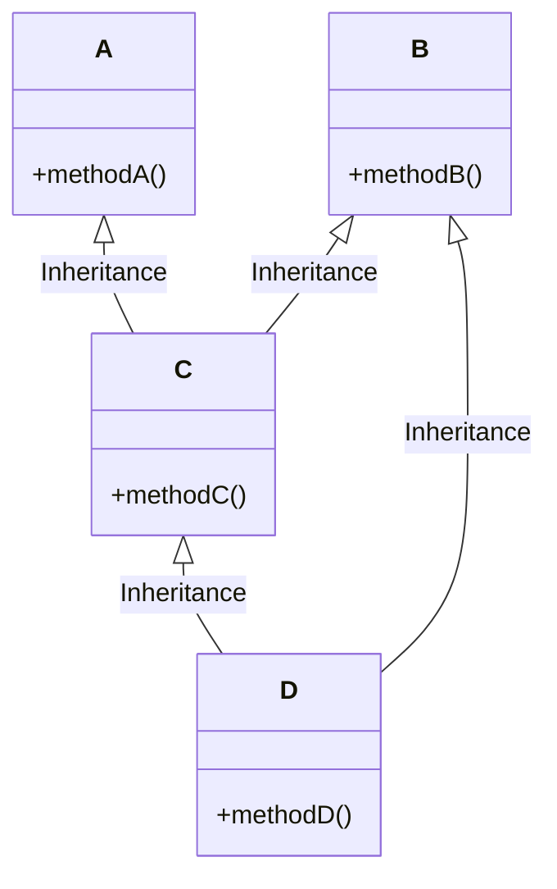
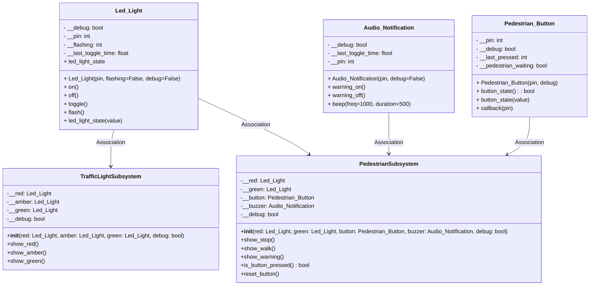

# Lecture 6

## Lecture 6 Concepts

- [Multiple Inheritance](#multiple-inheritance)
- [Association](#association)
- [Facade Pattern](#facade-pattern)
- [Implement the Subsystems](#implement-the-subsystems)
  - [Create Files](#create-files)
  - [Imports](#imports)
  - [Define the TrafficLightSubsystem](#define-the-trafficlightsubsystem)
  - [Implement the TrafficLightSubsystem States](#define-the-trafficlightsubsystem-states)
  - [Define the PedestrianSubsystem](#define-the-pedestriansubsystem)
  - [Implement the PedestrianSubsystem States](#define-the-pedestriansubsystem-states)

## Multiple Inheritance
Multiple Inheritance is used to inherit the properties of multiple classes. However, Python does not allow multiple inheritance from classes that have incompatible memory layouts at the C level, which is common with hardware in MicroPython.



This code snippet demonstrates the concept and syntax of multiple inheritance. 

```python
from led_light import Led_Light
from pedestrian_button import Pedestrian_Button
from audio_notification import Audio_Notification


class Walk_Light(Audio_Notification, Led_Light):
    def __init__(self, led_pin, buz_pin, debug):
        Led_Light.super().__init__(self, led_pin, False, debug)
        Audio_Notification.super().__init__(self, buz_pin, debug)

    def walk_on(self):
        if self.__debug:
            print("Beep and Light on")
        self.on()
        self.warning_on()

    def walk_off(self):
        if self.__debug:
            print("Beep and Light off")
        self.off()
        self.warning_off()
```

## Association

Association in Object-Oriented Programming (OOP) describes the relationship between two separate es that are connected, but neither "owns" the other. It simply means that objects of one class interact with or use objects of another class.

- Association is a broad term for any relationship between classes that is not inheritance.
- It represents a "uses-a" or "knows-a" relationship.
- The lifetime of associated objects is independent—neither object controls the lifecycle of the other.



## Facade pattern 
The Facade Pattern provides a simplified interface to a complex subsystem, shielding clients from the complexity of its components. Subsystems help manage complexity, improve modularity, and make systems more maintainable, testable, and understandable.

Continuing our 'Bottom-Up' approach, we will create two subsystems, one for traffic and one for pedestrians.

## Implement the Subsystems

### Create Files

1. Create a Python file in `project\lib` called `controller.py`
2. Create a Python file in `project\py_scripts` called `v06.py`

### Imports

In your `controller.py`, include your imports. This imports all the associated classes and the time library needed for the final controller class.

```python
from led_light import Led_Light
from pedestrian_button import Pedestrian_Button
from audio_notification import Audio_Notification
from time import sleep, time
```

### Define the TrafficLightSubsystem

```python
class TrafficLightSubsystem:
    def __init__(self, red, amber, green, debug=False):
        self.__red = red
        self.__amber = amber
        self.__green = green
        self.__debug = debug
```

### Implement the TrafficLightSubsystem

```python
    def show_red(self):
        if self.__debug:
            print("Traffic: Red ON")
        self.__red.on()
        self.__amber.off()
        self.__green.off()

    def show_amber(self):
        if self.__debug:
            print("Traffic: Amber ON")
        self.__red.off()
        self.__amber.on()
        self.__green.off()

    def show_green(self):
        if self.__debug:
            print("Traffic: Green ON")
        self.__red.off()
        self.__amber.off()
        self.__green.on()
```

### Define the PedestrianSubsystem

```python
class TrafficLightSubsystem:
    def __init__(self, red, green, button, buzzer, debug=False):
        self.__red = red
        self.__green = green
        self.__button = button
        self.__buzzer = buzzer
        self.__debug = debug
```

### Implement the PedestrianSubsystem States

```python
    def show_stop(self):
        if self.__debug:
            print("Pedestrian: Red ON")
        self.__red.on()
        self.__green.off()
        self.__buzzer.warning_off()

    def show_walk(self):
        if self.__debug:
            print("Pedestrian: Green ON")
        self.__red.off()
        self.__green.on()
        self.__buzzer.warning_on()

    def show_warning(self):
        if self.__debug:
            print("Pedestrian: Warning")
        self.__red.flash()
        self.__green.off()
        self.__buzzer.warning_off()

    def is_button_pressed(self):
        return self.__button.button_state

    def reset_button(self):
        self.__button.button_state = False
```
